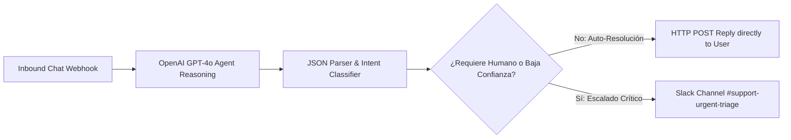

# 🤖 Autonomous AI Support & FAQ Agent with Human Handoff (Make.com)

> Sistema autónomo de atención a clientes y triage de incidentes diseñado en **Make.com**, basado en la arquitectura **AI Agent Builder**. Clasifica intenciones de clientes en tiempo real, responde consultas frecuentes de primer nivel de forma instantánea y detecta de manera inteligente cuándo transferir a un agente humano en Slack con el contexto completo.

---

## 📐 Diagrama de Arquitectura

---

## 🎯 Problema de Negocio & Solución

* **Problema:** Un equipo de soporte SaaS atendía más de 400 tickets diarios. El 70% eran preguntas repetitivas (facturación, reset de contraseñas, estado de API), pero las solicitudes críticas de reembolsos quedaban atrapadas en la cola con demoras de hasta 5 horas.
* **Solución Implementada:**
  1. El agente de IA responde consultas estándar en menos de 10 segundos con tono profesional y verificado.
  2. Mediante Structured Outputs, evalúa el sentimiento del usuario y el parámetro `requires_human`.
  3. Si el cliente pide reembolso, cancelación o manifiesta enojo, el flujo detiene la respuesta automática y crea un ticket prioritario en Slack con el resumen exacto del problema para atención humana inmediata.

---

## 📊 Métricas de Negocio & Impacto (ROI)

* **Resolución en Primer Contacto (FCR):** **64%** de las consultas resueltas sin intervención de agentes humanos.
* **Tiempo promedio de resolución:** Reducido de **4 horas a 12 segundos** para casos comunes.
* **Ahorro operativo:** Reducción de más de **\$2,200 USD mensuales** en costos de soporte de nivel 1.

---

## 🚀 Cómo Importar el Blueprint en Make.com

1. Inicia sesión en tu cuenta de [Make.com](https://make.com).
2. Crea un nuevo Escenario (**Create a new scenario**).
3. En la barra inferior de controles, haz clic en el botón de tres puntos `...` y selecciona **Import Blueprint**.
4. Sube el archivo [`blueprint_make.json`](./blueprint_make.json).
5. Conecta tus conexiones de **OpenAI** y **Slack**.
6. ¡Listo para activar y probar con el evento de ejemplo [`test_event.json`](./test_event.json)!

---

*Desarrollado por Lorenzo Cona — AI & Automation / Integration Engineer.*
